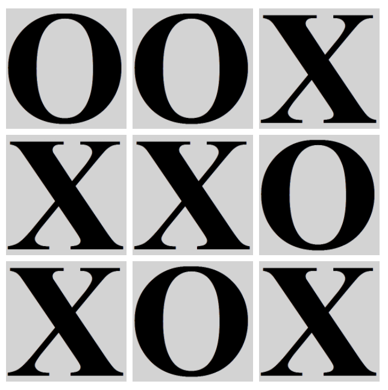
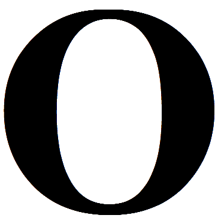

# Tic Tac Toe

A JavaScript project walk-through for novice programmers.

In this project you will develop an unbeatable AI for Tic Tac Toe. [Check it out](https://mikegagnon.github.io/tic-tac-toe/).

## Prerequisites

Mastery of [Lights Out](https://github.com/mikegagnon/lights-out/blob/master/README.md),
[Thumb Wrestling](https://github.com/mikegagnon/thumb-wrestling/blob/master/README.md),
recursion (see [linked lists](https://github.com/mikegagnon/linked-lists/blob/master/README.md) and
[binary search trees](https://github.com/mikegagnon/bst/blob/master/README.md)), and
[Sokoban+](https://github.com/mikegagnon/sokoban/blob/master/README.md).
And familiarity with OOP (object-orient programming) in JavaScript.

## Contents

- [Part 1. Two-player Tic Tac Toe](#part1)
  - [Lecture 1.1 Framework for `TicTacToe` class](#lec1-1)
  - [Lecture 1.2 Framework for controller and for `Viz` class](#lec1-2)
  - [Challenge 1.3 X's and O's](#c1-3)
  - [Challenge 1.4 Pretty graphics](#c1-4)
  - [Challenge 1.5 Game Over](#c1-5)
  - [Challenge 1.6 Highlight victory](#c1-6)
- [Part 2. Artificial Intelligence](#part2)
  - [Lecture 2.1 Introduction](#lec2-1)
  - [Lecture 2.2 Solving game trees](#lec2-2)
  - [Lecture 2.3 One-player framework](#lec2-3)
  - [Lecture 2.4 MinMax returns the best move](#lec2-4)
  - [Lecture 2.5 MinMax for Tic Tac Toe](#lec2-5)

# <a name="part1">Part 1. Two-player Tic Tac Toe</a>

## <a name="lec1-1">Lecture 1.1 Framework for `TicTacToe` class</a>

Initialize your Tic Tac Toe directory with the following two files:

### `index.html`

```html
<!DOCTYPE html>
<html>
  <head>
    <title>Tic Tac Toe</title>
  </head>

  <script src="tic-tac-toe.js"></script>

</html>
```

### `tic-tac-toe.js`

Study this code (including tests) until it makes 100% sense to you.

```js
function assert(condition) {
    if (!condition) {
        console.error("Assertion failed");
    }
}

NUM_ROWS = 3;
NUM_COLS = 3;

EMPTY = 0;
PLAYER_X = 1;
PLAYER_O = 2;s

class TicTacToe {

    constructor() {
        this.matrix = [
            [EMPTY, EMPTY,EMPTY],
            [EMPTY, EMPTY,EMPTY],
            [EMPTY, EMPTY,EMPTY]
        ];
    }

    makeMove(row, col) {

        assert(row >= 0 && row < NUM_ROWS);
        assert(col >= 0 && col < NUM_COLS);

        this.matrix[row][col] = PLAYER_X;
    }

}

/*******************************************************************************
 * TESTS
 ******************************************************************************/

// Returns true iff the matrices are equal 
function matricesEqual(matrix1, matrix2) {
    for (row = 0; row < NUM_ROWS; row++) {
        for (col = 0; col < NUM_COLS; col++) {
            if (matrix1[row][col] != matrix2[row][col]) {
                return false;
            }
        }
    }

    return true;
}

// Test player-x makeMove(0, 0)
var game = new TicTacToe();
game.makeMove(0, 0);
var expected_matrix = [
    [PLAYER_X, EMPTY, EMPTY],
    [EMPTY,    EMPTY, EMPTY],
    [EMPTY,    EMPTY, EMPTY]
]
assert(matricesEqual(game.matrix, expected_matrix));

// Test player-x makeMove(1, 1)
var game = new TicTacToe();
game.makeMove(1, 1);
var expected_matrix = [
    [EMPTY,    EMPTY,    EMPTY],
    [EMPTY,    PLAYER_X, EMPTY],
    [EMPTY,    EMPTY,    EMPTY]
]
assert(matricesEqual(game.matrix, expected_matrix));
```


## <a name="lec1-2">Lecture 1.2 Framework for controller and for `Viz` class</a>

Study this code until it makes 100% sense to you.

### `style.css`

```css
.row {
    clear: left;
}

.cell {
    height: 100px;
    width: 100px;
    margin-left: 5px;
    margin-top: 5px;
    float: left; 
    background-color: lightgray;
    cursor: pointer;
}
```

### `index.html`

Update your `index.html` file to do the following:

- Import `style.css`
- Import `jquery.js`
- Create a 3&times;3 grid of cells

```html
<!DOCTYPE html>
<html>
  <head>
    <title>Tic Tac Toe</title>
    <link rel="stylesheet" type="text/css" href="style.css">
    <script src="jquery.js"></script>
  </head>
  <body>
    <div class="row">
      <div class="cell" id="cell-0-0" onclick="cellClick(0, 0)"></div>
      <div class="cell" id="cell-0-1" onclick="cellClick(0, 1)"></div>
      <div class="cell" id="cell-0-2" onclick="cellClick(0, 2)"></div>
    </div>
    <div class="row">
      <div class="cell" id="cell-1-0" onclick="cellClick(1, 0)"></div>
      <div class="cell" id="cell-1-1" onclick="cellClick(1, 1)"></div>
      <div class="cell" id="cell-1-2" onclick="cellClick(1, 2)"></div>
    </div>
    <div class="row">
      <div class="cell" id="cell-2-0" onclick="cellClick(2, 0)"></div>
      <div class="cell" id="cell-2-1" onclick="cellClick(2, 1)"></div>
      <div class="cell" id="cell-2-2" onclick="cellClick(2, 2)"></div>
    </div>
  </body>

  <script src="tic-tac-toe.js"></script>

</html>
```

### `tic-tac-toe.js`

```js
function assert(condition) {
    if (!condition) {
        console.error("Assertion failed");
    }
}

NUM_ROWS = 3;
NUM_COLS = 3;

EMPTY = 0;
PLAYER_X = 1;
PLAYER_O = 2;

/*******************************************************************************
 * Move is the interface between TicTacToe and Viz
 ******************************************************************************/
class Move {
    // valid == true iff the move results in change in game state
    // (row, col) are the coordinates that player added their mark
    // player is either PLAYER_X or PLAYER_O, depending on who made the move
    constructor(valid, row, col, player) {
        this.valid = valid;
        this.row = row;
        this.col = col;
        this.player = player;
    }
}

/*******************************************************************************
 * TicTacToe class
 ******************************************************************************/
class TicTacToe {

    constructor() {
        this.matrix = [
            [EMPTY, EMPTY,EMPTY],
            [EMPTY, EMPTY,EMPTY],
            [EMPTY, EMPTY,EMPTY]
        ];
    }

    makeMove(row, col) {

        assert(row >= 0 && row < NUM_ROWS);
        assert(col >= 0 && col < NUM_COLS);

        this.matrix[row][col] = PLAYER_X;

        return new Move(true, row, col, PLAYER_X);
    }

}

/*******************************************************************************
 * Vizualization code
 ******************************************************************************/
 class Viz {
    
    static getCellId(row, col) {
        return "cell-" + row + "-" + col;
    }

    constructor() { }

    drawMove(move) {
        if (!move.valid) {
            return;
        }

        var cellId = Viz.getCellId(move.row, move.col)
        $("#" + cellId).text("X") ;
    }
 }

/*******************************************************************************
 * Controller code
 ******************************************************************************/
var GAME = new TicTacToe();
var VIZ = new Viz();

function cellClick(row, col) {

    var move = GAME.makeMove(row, col);
    VIZ.drawMove(move);

}

/*******************************************************************************
 * TESTS
 ******************************************************************************/

// Returns true iff the matrices are equal 
function matricesEqual(matrix1, matrix2) {
    for (row = 0; row < NUM_ROWS; row++) {
        for (col = 0; col < NUM_COLS; col++) {
            if (matrix1[row][col] != matrix2[row][col]) {
                return false;
            }
        }
    }

    return true;
}

// Test player-x makeMove(0, 0)
var game = new TicTacToe();
game.makeMove(0, 0);
var expected_matrix = [
    [PLAYER_X, EMPTY, EMPTY],
    [EMPTY,    EMPTY, EMPTY],
    [EMPTY,    EMPTY, EMPTY]
]
assert(matricesEqual(game.matrix, expected_matrix));

// Test player-x makeMove(1, 1)
var game = new TicTacToe();
game.makeMove(1, 1);
var expected_matrix = [
    [EMPTY,    EMPTY,    EMPTY],
    [EMPTY,    PLAYER_X, EMPTY],
    [EMPTY,    EMPTY,    EMPTY]
]
assert(matricesEqual(game.matrix, expected_matrix));
```

### Result

If you play the game in your browser, you should see something like this:


## <a name="c1-3">Challenge 1.3 X's and O's</a>

The game, as it is in [Lecture 1.2](#lec1-2), only allows
moves for X's. Here, we will add O's to the game.

### Update `TicTacToe` constructor

```js
class TicTacToe {

    ...
    
    // player is either PLAYER_X or PLAYER_O, and indicates which player has
    // the opening move
    constructor(player) {
        this.matrix = [
            [EMPTY, EMPTY, EMPTY],
            [EMPTY, EMPTY, EMPTY],
            [EMPTY, EMPTY, EMPTY]
        ];
    
        assert(player == PLAYER_X || player == PLAYER_O);
    
        // this.player always equals the player (either PLAYER_X or PLAYER_O)
        // who has the next move.
        this.player = player;
    }
```

### Update `GAME` initialization

Recall, the controller code from [Lecture 1.2](#lec1-2), looks as follows:

```js
/*******************************************************************************
 * Controller code
 ******************************************************************************/
var GAME = new TicTacToe();
var VIZ = new Viz();

...
```

Since the `TicTacToe` constructor has changed, we must update the `GAME` initialization:

```js
/*******************************************************************************
 * Controller code
 ******************************************************************************/
var GAME = new TicTacToe(PLAYER_X); // <------------------------------------------------
var VIZ = new Viz();

...
```


### Update `makeMove(...)`

- In the `makeMove(...)` function, check to see if the move is valid. If it's not, then return
  an appropriate `Move` object.
- Update `makeMove(...)` so that this.player alternates between X's and O's
- Fix tests that are broken (since the constructor for TicTacToe has changed, the old tests will fail)
- Write new tests that verify/refute the correctness of your program

### Result

If you play the game in your browser, you should see something like this:


### Hints

- [Hint 1](#hint1-3-1)
- [Hint 2](#hint1-3-2)
- [Hint 3](#hint1-3-3)
- [Hint 4](#hint1-3-4)
- [Solution](#solution1-3)


## <a name="c1-4">Challenge 1.4 Pretty graphics</a>

We will update the vizualization code to use pretty graphics.
After this challenge, Tic Tac Toe will look something like this:



### Download images

Download these two images into your directory:





### Update `Viz`
Update the `Viz` constructor so it takes a `cell_size` argument,
and sets `this.cell_size = cell_size`, and sets the cell `<div>`
elements to the proper size.

```js
class Viz {
 
    ...
    
    constructor(cell_size) {
        this.cell_size = cell_size;
        
        $(".cell").css("height", this.cell_size);
        $(".cell").css("width", this.cell_size);
    }
}
```

### Update controller

Now that `Viz` has a new constructor, we need to update our initialization of `VIZ` inside the controller.

```js
/*******************************************************************************
 * Controller code
 ******************************************************************************/
var GAME = new TicTacToe(PLAYER_X);
var VIZ = new Viz(100); // <-----------------------------------------------------------
```

### The challenge
The challenge is to update `drawMove(...)` so that it draws either `player-x.png` to the cell,
or `player-o.png` to the cell, depending on `move.player`.

### Hints

- [Solution](#solution1-4)


## <a name="c1-5">Challenge 1.5 Game Over</a>

Let's detect when a game has reached it's end.

### Introducing the `GameOver` class

```js
// GameOver objects store information about the end of the game.
class GameOver {

    // There are two fields in a GameOver object:
    //      1. this.victor
    //      2. this.victoryCells
    //
    // this.victor
    // ===========
    // this.victor is equal to one of the following:
    //      (A) undefined
    //      (B) PLAYER_X
    //      (C) PLAYER_O
    //
    // if this.victor == undefined, then that indicates the game ended ina draw
    // if this.victor == PLAYER_X, then that indicates PLAYER_X won the game
    // if this.victor == PLAYER_O, then that indicates PLAYER_O won the game
    //
    // this.victoryCells
    // =================
    // this.victoryCells is either:
    //      (A) undefined
    //      (B) a list of three [row, col] pairs
    //
    // if this.victoryCells == undefined, then that indicates the game ended in
    // a draw.
    //
    // if this.victoryCells is a list of three [row, col] pairs, then that
    // indicates the game has ended in a victory. Furthermore the three 
    // [row, col] pairs indicate which cells contain the winning 3-in-a-row
    // marks.
    // 
    // As an example: this.victoryCells might equal [[0,0], [1,1], [2, 2]].
    // This denotes that (row 0, col 0), (row 1, col 1), and (row 2, col 2)
    // constitute the three cells that contain the winning 3-in-a-row marks.
    constructor(victor, victoryCells) {
        this.victor = victor;
        this.victoryCells = victoryCells;
    }
}
```

### Update the `Move` class

We add a `gameOver` reference to the `Move` class, which
will help the `Viz` class highlight the victorious cells
after a victory.

```js
class Move {
    // valid == true iff the move results in change in game state
    // (row, col) are the coordinates that player added their mark
    // player is either PLAYER_X or PLAYER_O, depending on who made the move
    // gameOver is either undefined (which signifies the game has not concluded)
    // or gameOver is a GameOver object, representing the conclusion of the game
    constructor(valid, row, col, player, gameOver) { // <------------------------------
        this.valid = valid;
        this.row = row;
        this.col = col;
        this.player = player;
        this.gameOver = gameOver; // <-------------------------------------------------
    }
}
```

### Update the `TicTacToe` constructor

```js
class TicTacToe {

    ...

    // player is either PLAYER_X or PLAYER_O, and indicates which player has
    // the opening move
    constructor(player) {
        this.matrix = [
            [EMPTY, EMPTY, EMPTY],
            [EMPTY, EMPTY, EMPTY],
            [EMPTY, EMPTY, EMPTY]
        ];

        assert(player == PLAYER_X || player == PLAYER_O);

        // this.player always equals the player (either PLAYER_X or PLAYER_O)
        // who has the next move.
        this.player = player;

        // If the game is over, then this.gameOver equals a GameOver object
        // that describes the properties of the conclusion of the game
        // If the game is not over, then this.gameOver is undefined;
        this.gameOver = undefined; // <------------------------------------------------

    }
}
```

### Update `makeMove(...)` method

We make three modifications to the `makeMove(...)` method.

1. We check to see if the game is over at the beginning of the method.
   This way we can exit the method right away if the game is already over.
2. We modify the instantiation of the `move` object by adding
   `this.gameOver` to the argument list (since the `Move` constructor
   now takes a `gameOver` argument).
3. We invoke `this.checkGameOver()`, which is the subject of the next section.

```js
class TicTacToe {

    ...

    makeMove(row, col) {

        assert(row >= 0 && row < NUM_ROWS);
        assert(col >= 0 && col < NUM_COLS);

        if (this.matrix[row][col] != EMPTY || this.gameOver != undefined) { // <--------------------------
            return new Move(false, undefined, undefined, undefined);
        } 

        this.matrix[row][col] = this.player;

        this.checkGameOver(); // <------------------------------------------------------------------------

        var move = new Move(true, row, col, this.player, this.gameOver); // <-----------------------------

        if (this.player == PLAYER_X) {
            this.player = PLAYER_O;
        } else {
            this.player = PLAYER_X;
        }

        return move;
    }
}
```

### Challenge: implement `checkGameOver()`

```js
class  TicTacToe {

    ...

    // Determines whether or not the game has reached its conclusion.
    // If the game is over, then sets this.gameOver to a GameOver object
    // representing the conclusion of the game.
    checkGameOver() {
        // ?
    }
}
```

### Hints

- [Hint 1](#hint1-5-1)
- [Hint 2](#hint1-5-2)
- [Hint 3](#hint1-5-3)
- [Hint 4](#hint1-5-4)
- [Hint 5](#hint1-5-5)
- [Hint 6](#hint1-5-6)
- [Solution](#solution1-5) 

### Tests

These tests verify/refute the correctness of `checkGameOver()`: 

```js
/* TESTS for checkGameOver ****************************************************/

// Vertical victories
var game = new TicTacToe(PLAYER_X);
game.matrix = [
    [PLAYER_X,    EMPTY,    EMPTY],
    [PLAYER_X,    EMPTY,    EMPTY],
    [PLAYER_X,    EMPTY,    EMPTY]
];
game.checkGameOver()
assert(game.gameOver.victor == PLAYER_X);
assert(matricesEqual(game.gameOver.victoryCells, [[0,0], [1,0], [2,0]]));

var game = new TicTacToe(PLAYER_X);
game.matrix = [
    [EMPTY,    PLAYER_O,    EMPTY],
    [EMPTY,    PLAYER_O,    EMPTY],
    [EMPTY,    PLAYER_O,    EMPTY]
];
game.checkGameOver()
assert(game.gameOver.victor == PLAYER_O);
assert(matricesEqual(game.gameOver.victoryCells, [[0,1], [1,1], [2,1]]));

var game = new TicTacToe(PLAYER_X);
game.matrix = [
    [EMPTY,    EMPTY,    PLAYER_O],
    [EMPTY,    EMPTY,    PLAYER_O],
    [EMPTY,    EMPTY,    PLAYER_O]
];

game.checkGameOver()
assert(game.gameOver.victor == PLAYER_O);
assert(matricesEqual(game.gameOver.victoryCells, [[0,2], [1,2], [2,2]]));

// Horizonal victories
var game = new TicTacToe(PLAYER_X);
game.matrix = [
    [PLAYER_X, PLAYER_X, PLAYER_X],
    [EMPTY,    EMPTY,    EMPTY],
    [EMPTY,    EMPTY,    EMPTY]
];
game.checkGameOver()
assert(game.gameOver.victor == PLAYER_X);
assert(matricesEqual(game.gameOver.victoryCells, [[0,0], [0,1], [0,2]]));

var game = new TicTacToe(PLAYER_X);
game.matrix = [
    [EMPTY,    EMPTY,    EMPTY],
    [PLAYER_X, PLAYER_X, PLAYER_X],
    [EMPTY,    EMPTY,    EMPTY]
];
game.checkGameOver()
assert(game.gameOver.victor == PLAYER_X);
assert(matricesEqual(game.gameOver.victoryCells, [[1,0], [1,1], [1,2]]));

var game = new TicTacToe(PLAYER_X);
game.matrix = [
    [EMPTY,    EMPTY,    EMPTY],
    [EMPTY,    EMPTY,    EMPTY],
    [PLAYER_X, PLAYER_X, PLAYER_X],
];
game.checkGameOver()
assert(game.gameOver.victor == PLAYER_X);
assert(matricesEqual(game.gameOver.victoryCells, [[2,0], [2,1], [2,2]]));

// Diagonal victories
var game = new TicTacToe(PLAYER_X);
game.matrix = [
    [PLAYER_X, EMPTY,    EMPTY],
    [EMPTY,    PLAYER_X, EMPTY],
    [EMPTY,    EMPTY,    PLAYER_X]
];
game.checkGameOver()
assert(game.gameOver.victor == PLAYER_X);
assert(matricesEqual(game.gameOver.victoryCells, [[0,0], [1,1], [2,2]]));

var game = new TicTacToe(PLAYER_X);
game.matrix = [
    [EMPTY,    EMPTY,    PLAYER_O],
    [EMPTY,    PLAYER_O, EMPTY],
    [PLAYER_O, EMPTY,    EMPTY]
];
game.checkGameOver()
assert(game.gameOver.victor == PLAYER_O);
assert(matricesEqual(game.gameOver.victoryCells, [[0,2], [1,1], [2,0]]));

// Draws
var game = new TicTacToe(PLAYER_X);
game.matrix = [
    [PLAYER_O, PLAYER_X, PLAYER_O],
    [PLAYER_X, PLAYER_X, PLAYER_O],
    [PLAYER_O, PLAYER_O, PLAYER_X]
];
game.checkGameOver()
assert(game.gameOver.victor == undefined);
assert(game.gameOver.victoryCells == undefined);

```


## <a name="c1-6">Challenge 1.6 Highlight victory</a>

Update `drawMove(...)` so that in a victory, the winning cells are highlighted with color #F7DC6F. (I used http://htmlcolorcodes.com/ to pick the color)

- [Solution](#solution1-6)


<br><br><br>

# <a name="part2">Part 2. Artificial Intelligence</a>

## <a name="lec2-1">Lecture 2.1 Introduction</a>

In Part 2 of this project will will develop an AI for Tic Tac Toe, so that
a human player may play against the computer. Our AI will be unbeatable;
it will not be possible for a human player to defeat our AI.

How do we accomplish such a feat? We will use a classic algorithm known as *MinMax*.
MinMax is awesome.

For decades, computer scientists and software engineers have been
using MinMax to produce absurdly strong AIs. 

The first time MinMax defeated a chess world champion was in 1996, against
Garry Kasparov. Kasparov said he "saw deep intelligence and creativity in the machine's moves."

However, despite Kasparov's romantic glamorization of MinMax,
MinMax is neither a deep intelligence, nor is it creative.

Rather, MinMax is plain, boring, simple, beautiful, brute force. You will see how and why later.


## <a name="lec2-2">Lecture 2.2 Solving game trees</a>

Recall [binary search trees](https://github.com/mikegagnon/bst/blob/master/README.md).

A tree is a network of nodes that branch out like a tree.

A *game tree* is a tree where:

1. the nodes contain game states
2. the children of a parent represent the game states that are one step away from the parent. 

Game trees might be easier to visualize than to explain in English. Here is an abridged diagram for the 
Tic Tac Toe game tree:


### Game tree analysis 1

Consider the following game tree:


Assuming it is Blue's turn, and the game state matches the root node:

1. Which move should Blue make? Left or right?
2. If both Red and Blue play perfectly, how will the game end? Red win, Blue win, or Draw?

#### Which move should Blue make? Left or right?

Clearly, Blue should go left. Going right would certainly result in Red winning the game.

#### If both Red and Blue play perfectly, how will the game end? Red win, Blue win, or Draw?

The game ends in a draw. Here's why:

- Blue goes left
- Next, Red can go left or right
  - If Red goes left, then Blue will go for a draw (right)
  - If Red goes right, then Blue will go for a win (left)
  - Therefore Red goes left
- Next, Blue goes right and ends the game in a draw

### Game tree analysis 2

Consider the following game tree:


Assuming it is Red's turn, and the game state matches the root node:

1. Which move should Red make? Left or right?
2. If both Red and Blue play perfectly, how will the game end? Red win, Blue win, or Draw?

These questions may be more difficult this time. If you're stumped, the following section
will explain the trick for solving this puzzle.

### How to solve a game tree

Now we will introduce the spirit of MinMax. Here's how to solve a game tree.

First, I need to introduce the concept of *crystal balls*.

#### Example 1


There are three nodes in this game tree. Attached to the left of each node, is a crystal ball.
The crystal ball for a node denotes the destiny for that node: whether the game will end
in a Red victory, Blue victory, or a draw (assuming both players are play perfectly).

For this example, the destiny of the root node is clearly a draw because a draw is Blue's best move.

#### Example 2


In this example, what is the crystal ball for the root Red node? To figure this out, we only need
to look at the crystal balls for its two children:

- If the root Red node goes left, it is destined for a draw (assuming perfect play)
- If the root Red node goes right, it is destined for a Blue victory (assuming perfect play)

Therefore, the Red node inherits the crystal ball of its left child, since draw is a better destiny than Blue victory.


#### Crystal Ball Algorithm

How to determine the crystal ball for a given node:

1. Look at the crystal balls for node's children
2. node's crystal ball = the "best" crystal ball amongst node's children, where the notion of best is determined by whether it is blue's turn, or red's turn.

#### Example 3


Do you see the crystal-ball pattern?

### Score values instead of crystal balls

In order to turn our crystal-ball algorithm into an algorithm a computer can understand,
we replace crystal balls with score values.


### MinMax

Now, we can express the MinMax function for solving games:

```js

// Arguments:
//    node is the node for which we want to calculate its score
//    maximizingPlayer is true if node wants to maximize its score
//    maximizingPlayer is false if node wants to minimize its score
//
// minMax(node, player) returns the best possible score
// that the player can achieve from this node
//
// node must be an object with the following methods:
//    node.isLeaf()
//    node.getScore()
//    node.getChildren()
function minMax(node, maximizingPlayer) {
    if (node.isLeaf()) {
        return node.getScore();
    }

    // If the node wants to maximize its score:
    if (maximizingPlayer) {
        var bestScore = Number.MIN_SAFE_INTEGER;

        // find the child with the highest score
        var children = node.getChildren();
        for (var i = 0; i < children.length; i++) {
            var child = children[i];
            var childScore = minMax(child, false);
            bestScore = Math.max(childScore, bestScore)
        }
        return bestScore;
    }

    // If the node wants to minimize its score:
    else {
        var bestScore = Number.MAX_SAFE_INTEGER;

        // find the child with the lowest score
        var children = node.getChildren();
        for (var i = 0; i < children.length; i++) {
            var child = children[i];
            var childScore = minMax(child, true);
            bestScore = Math.min(childScore, bestScore)
        }
        return bestScore;
    }
}
```

#### Testing MinMax

To test our `minMax` function we encode the game tree from Example 4 into a tree of `DummyNode` objects.
Here is the class definition for `DummyNode`:

```js
class DummyNode {

    constructor(children, score = undefined) {
        this.children = children;
        this.score = score;
    }

    isLeaf() {
        return this.children.length == 0;
    }

    getScore() {
        assert(this.isLeaf());
        return this.score;
    }

    getChildren() {
        return this.children;
    }
}
```

Then, we manually build our game tree:

```js
// Red layer
var redLeaf = new DummyNode([], 1);
var blueLeaf = new DummyNode([], -1);
var drawLeaf = new DummyNode([], 0);

// Blue layer
var nodeA = new DummyNode([redLeaf, drawLeaf]);
var nodeB = new DummyNode([blueLeaf, drawLeaf]);
var nodeC = new DummyNode([blueLeaf, redLeaf]);
var nodeD = new DummyNode([blueLeaf, drawLeaf]);
var nodeE = new DummyNode([redLeaf, drawLeaf]);
var nodeF = new DummyNode([blueLeaf, drawLeaf]);
var nodeG = new DummyNode([redLeaf, redLeaf]);
var nodeH = new DummyNode([redLeaf, redLeaf]);

// Red layer
var nodeI = new DummyNode([nodeA, nodeB]);
var nodeJ = new DummyNode([nodeC, nodeD]);
var nodeK = new DummyNode([nodeE, nodeF]);
var nodeL = new DummyNode([nodeG, nodeH]);

// Blue layer
var nodeM = new DummyNode([nodeI, nodeJ]);
var nodeN = new DummyNode([nodeK, nodeL]);

// Red layer
var nodeRoot = new DummyNode([nodeM, nodeN]);
```

Then we test that `minMax(...)` works correctly for each node:

```js
assert(minMax(redLeaf, true) == 1);
assert(minMax(blueLeaf, true) == -1);
assert(minMax(drawLeaf, true) == 0);

assert(minMax(nodeA, false) == 0);
assert(minMax(nodeB, false) == -1);
assert(minMax(nodeC, false) == -1);
assert(minMax(nodeD, false) == -1);
assert(minMax(nodeE, false) == 0);
assert(minMax(nodeF, false) == -1);
assert(minMax(nodeG, false) == 1);
assert(minMax(nodeH, false) == 1);

assert(minMax(nodeI, true) == 0);
assert(minMax(nodeJ, true) == -1);
assert(minMax(nodeK, true) == 0);
assert(minMax(nodeL, true) == 1);

assert(minMax(nodeM, false) == -1);
assert(minMax(nodeN, false) == 0);

assert(minMax(nodeRoot, true) == 0);
```


## <a name="lec2-3">Lecture 2.3 One-player framework</a>

Before applying MinMax to Tic Tac Toe, lets modify our game
to be a one-player game, using an stupid AI.

It should be clear to what these code changes are, and how they work,
by studying the code.

### `makeAiMove(...)`

```js
/*******************************************************************************
 * AI code
 ******************************************************************************/

function makeAiMove(game) {

    assert(!game.gameOver);

    for (var row = 0; row < NUM_ROWS; row++) {
        for (var col = 0; col < NUM_COLS; col++) {
            if (game.matrix[row][col] == EMPTY) {
                return game.makeMove(row, col);
            }
        }
    }
}
```

### `FIRST_PLAYER`

Near the top of `tic-tac-toe.js` add the following:

```js
+var FIRST_PLAYER = undefined;
+
+if (Math.random() < 0.5) {
+    FIRST_PLAYER = PLAYER_X;
+} else {
+    FIRST_PLAYER = PLAYER_O;
+}
```

### New controller

```js
/*******************************************************************************
 * Controller code
 ******************************************************************************/
var GAME = new TicTacToe(FIRST_PLAYER);
var VIZ = new Viz(100);

if (FIRST_PLAYER == PLAYER_O) {
    move = makeAiMove(GAME);
    VIZ.drawMove(move);
}

function cellClick(row, col) {

    var move = GAME.makeMove(row, col);
    VIZ.drawMove(move);

    if (move.valid && !GAME.gameOver) {
        move = makeAiMove(GAME);
        VIZ.drawMove(move);
    }

}
```


## <a name="lec2-4">Lecture 2.4 MinMax returns the best move</a>

You may have noticed it already: our current `minMax(...)` implementation has
a limitation. Specifically, `minMax(...)` returns the result of the game (assuming
perfect play), but `minMax(...)` does not return the best move.

For example, in the game tree below, the root node's best move is to go to the right.


We want `minMax(root, true)` to return `"right"`, so that way the Red AI
can be told to move `"right"`.

Below is an updated `minMax(...)` function that does just that.
Now it returns a pair `[bestMove, bestScore]`.

In order for this new `minMax(...)` to work, `Node` objects
must have a method `getMove()` that returns a value (or object)
representing the move from `node` to `child`.

```js
// Arguments:
//    node is the node for which we want to calculate its score
//    maximizingPlayer is true if node wants to maximize its score
//    maximizingPlayer is false if node wants to minimize its score
//
// minMax(node, player) returns the best possible score
// that the player can achieve from this node
//
// node must be an object with the following methods:
//    node.isLeaf()
//    node.getScore()
//    node.getChildren()
//    node.getMove()
function minMax(node, maximizingPlayer) {
    if (node.isLeaf()) {
        return [node.getMove(), node.getScore()];
    }

    // If the node wants to maximize its score:
    if (maximizingPlayer) {
        var bestScore = Number.MIN_SAFE_INTEGER;
        var bestMove = undefined;

        // find the child with the highest score
        var children = node.getChildren();
        for (var i = 0; i < children.length; i++) {
            var child = children[i];
            var [_, childScore] = minMax(child, false);
            bestScore = Math.max(childScore, bestScore);

            if (bestScore == childScore) {
                bestMove = child.getMove();
            }

        }
        return [bestMove, bestScore];
    }

    // If the node wants to minimize its score:
    else {
        var bestScore = Number.MAX_SAFE_INTEGER;
        var bestMove = undefined;

        // find the child with the lowest score
        var children = node.getChildren();
        for (var i = 0; i < children.length; i++) {
            var child = children[i];
            var [_, childScore] = minMax(child, true);
            bestScore = Math.min(childScore, bestScore);

            if (bestScore == childScore) {
                bestMove = child.getMove();
            }
        }
        return [bestMove, bestScore];
    }
}
```

Study this new `minMax(...)` implemention until it makes 100% sense to you.


## <a name="lec2-5">Lecture 2.5 MinMax for Tic Tac Toe</a>

To get `minMax(...)` to work with with the `TicTacToe` class,
all we need to do is:

1. Implement a `Node` class for `TicTacToe`
2. Modify the `makeAiMove(...)` function to invoke `minMax(...)`

Then, we will have an unbeatable Tic Tac Toe AI.

### Implement a `Node` class for `TicTacToe`

```js
/*******************************************************************************
 * Node class
 ******************************************************************************/

class Node {

    // ticTacToe is an instance of the TicTacToe class
    // move is either undefined (signifying this node is the root of the game
    // game tree), or move is an instance of the Move class and represents
    // the move from this node's parent to this node.
    constructor(ticTacToe, move = undefined) {
        this.ticTacToe = ticTacToe;
        this.move = move;
    }

    getMove() {
        return this.move;
    }

    isLeaf() {
        return this.ticTacToe.gameOver != undefined;
    }

    // Player X is always the maximizing player
    getScore() {
        assert(this.ticTacToe.gameOver != undefined);

        if (this.ticTacToe.gameOver.victor == undefined) {
            return 0;
        } else if (this.ticTacToe.gameOver.victor == PLAYER_X) {
            return 1;
        } else {
            return -1;
        }
    }

    getChildren() {
        // ?
    }
}
```

The implementation of the `Node` class should be clear to you, except
for the `getChildren()` method which we haven't yet defined.

Here is a partial implementaton of the `getChildren()` method:

```js
/*******************************************************************************
 * Node class
 ******************************************************************************/

class Node {

    ...

    // Recall, in a game tree every node (except a leaf node)
    // is a parent. The children of a parent represent
    // all the possible moves a parent can make.
    getChildren() {

        var childrenNodes = [];

        for (var row = 0; row < NUM_ROWS; row++) {
            for (var col = 0; col < NUM_COLS; col++) {
            
                // We need to add a `clone()` method to the
                // TicTacToe class that returns a "deep copy"
                // of the ticTacToe object
                var childGame = this.ticTacToe.clone();
                
                var move = childGame.makeMove(row, col);

                if (move.valid) {
                    var childNode = new Node(childGame, move);
                    childrenNodes.push(childNode);
                }
            }
        }

        assert(childrenNodes.length > 0);

        return childrenNodes;
    }
}
```


<br><br><br><br><br><br><br><br><br><br><br><br><br><br><br><br><br><br><br><br><br>

Keep studying MinMax until it is 100% clear how it works.

## <a name="hint1-3-1">Hint 1 for Challenge 1.3</a>

Check to see if the move is valid:

```js
class TicTacToe {

    makeMove(row, col) {

        assert(row >= 0 && row < NUM_ROWS);
        assert(col >= 0 && col < NUM_COLS);

        if (this.matrix[row][col] != EMPTY) {
            return new Move(false, undefined, undefined, undefined);
        } 
        ...
    }
}
```
<br><br><br><br><br><br><br><br><br><br><br><br><br><br><br><br><br><br><br><br><br>

## <a name="hint1-3-2">Hint 2 for Challenge 1.3</a>

Alterante turns between X's and O's:

```js
class TicTacToe {

    makeMove(row, col) {

        assert(row >= 0 && row < NUM_ROWS);
        assert(col >= 0 && col < NUM_COLS);

        if (this.matrix[row][col] != EMPTY) {
            return new Move(false, undefined, undefined, undefined);
        } 

        this.matrix[row][col] = this.player;

        var move = new Move(true, row, col, this.player);

        if (this.player == PLAYER_X) {
            this.player = PLAYER_O;
        } else {
            this.player = PLAYER_X;
        }

        return move;
    }
}
```

<br><br><br><br><br><br><br><br><br><br><br><br><br><br><br><br><br><br><br><br><br>

## <a name="hint1-3-3">Hint 3 for Challenge 1.3</a>

Fix broken tests:

```js
// Test player-x makeMove(0, 0)
var game = new TicTacToe(PLAYER_X); // <-------------------------
game.makeMove(0, 0);
var expected_matrix = [
    [PLAYER_X, EMPTY, EMPTY],
    [EMPTY,    EMPTY, EMPTY],
    [EMPTY,    EMPTY, EMPTY]
]
assert(matricesEqual(game.matrix, expected_matrix));

// Test player-x makeMove(1, 1)
var game = new TicTacToe(PLAYER_X); // <-------------------------
game.makeMove(1, 1);
var expected_matrix = [
    [EMPTY,    EMPTY,    EMPTY],
    [EMPTY,    PLAYER_X, EMPTY],
    [EMPTY,    EMPTY,    EMPTY]
]
assert(matricesEqual(game.matrix, expected_matrix));
```

<br><br><br><br><br><br><br><br><br><br><br><br><br><br><br><br><br><br><br><br><br>

## <a name="hint1-3-4">Hint 4 for Challenge 1.3</a>

New tests:

```js

// Test opening player as PLAYER_O
var game = new TicTacToe(PLAYER_O);
game.makeMove(0, 0);
var expected_matrix = [
    [PLAYER_O, EMPTY,    EMPTY],
    [EMPTY,    EMPTY,    EMPTY],
    [EMPTY,    EMPTY,    EMPTY]
]
assert(matricesEqual(game.matrix, expected_matrix));

// Test X then O then X
var game = new TicTacToe(PLAYER_X);
game.makeMove(1, 1);
game.makeMove(0, 0);
game.makeMove(2, 2);
var expected_matrix = [
    [PLAYER_O, EMPTY,    EMPTY],
    [EMPTY,    PLAYER_X, EMPTY],
    [EMPTY,    EMPTY,    PLAYER_X]
]
assert(matricesEqual(game.matrix, expected_matrix));

// Test invalid move
var game = new TicTacToe(PLAYER_X);
game.makeMove(0, 0);
var move = game.makeMove(0, 0);
assert(!move.valid);
var expected_matrix = [
    [PLAYER_X, EMPTY, EMPTY],
    [EMPTY,    EMPTY, EMPTY],
    [EMPTY,    EMPTY, EMPTY]
]
assert(matricesEqual(game.matrix, expected_matrix));
```

<br><br><br><br><br><br><br><br><br><br><br><br><br><br><br><br><br><br><br><br><br>

## <a name="solution1-3">Solution for Challenge 1.3</a>

The solution is simply the union of all the hints:

- [Hint 1](#hint1-3-1)
- [Hint 2](#hint1-3-2)
- [Hint 3](#hint1-3-3)
- [Hint 4](#hint1-3-4)

<br><br><br><br><br><br><br><br><br><br><br><br><br><br><br><br><br><br><br><br><br>

## <a name="solution1-4">Solution for Challenge 1.4</a>

```js
 class Viz {
    
    static getCellId(row, col) {
        return "cell-" + row + "-" + col;
    }

    getImgTag(player) {
        var filename;
        if (player == PLAYER_X) {
            filename = "player-x.png";
        } else if (player == PLAYER_O) {
            filename = "player-o.png";
        } else {
            assert(false);
        }

        return "";
    }

    constructor(cell_size) {
        this.cell_size = cell_size;

        $(".cell").css("height", this.cell_size);
        $(".cell").css("width", this.cell_size);
    }

    drawMove(move) {
        if (!move.valid) {
            return;
        }

        var cellId = Viz.getCellId(move.row, move.col);
        var imgTag = this.getImgTag(move.player);
        $("#" + cellId).append(imgTag);
    }
 }
```


- [Hint 1](#hint1-5-1) Categories for game over
- [Hint 2](#hint1-5-2) shell implementation
- [Hint 3](#hint1-5-3) implementation of checkVictoryHorizontal
- [Hint 4](#hint1-5-4) implementation of checkVictoryVertical
- [Hint 5](#hint1-5-5) implementation of checkVictoryDiagonal
- [Hint 6](#hint1-5-6) explanation of checkDraw
- [Solution](#solution1-5) 

<br><br><br><br><br><br><br><br><br><br><br><br><br><br><br><br><br><br><br><br><br>

## <a name="hint1-5-1">Hint 1 for Challenge 1.5</a>

There are several ways a Tic Tac Toe game may end:
- A horizontal 3-in-a-row
- A vertical 3-in-a-row
- A diagonal 3-in-a-row
- A draw, which occurs when there is not a 3-in-a-row and every cell is occupied


<br><br><br><br><br><br><br><br><br><br><br><br><br><br><br><br><br><br><br><br><br>

## <a name="hint1-5-2">Hint 2 for Challenge 1.5</a>

```js

class TicTacToe {

    ...

    // Determines whether or not the game has reached its conclusion.
    // If the game is over, then sets this.gameOver to a GameOver object
    // representing the conclusion of the game.
    checkGameOver() {
        this.checkVictoryHorizontal();
        this.checkVictoryVertical();
        this.checkVictoryDiagonal();
        if (this.gameOver == undefined) {
            this.checkDraw();
        }
    }
 }
```

Now implement:

- `checkVictoryHorizontal()`
- `checkVictoryVertical()`
- `checkVictoryDiagonal()`
- `checkDraw()`

<br><br><br><br><br><br><br><br><br><br><br><br><br><br><br><br><br><br><br><br><br>

## <a name="hint1-5-3">Hint 3 for Challenge 1.5</a>

```js
class TicTacToe {

    ...

    checkVictoryHorizontal() {
        for (var row = 0; row < NUM_ROWS; row++) {
            var a = this.matrix[row][0];
            var b = this.matrix[row][1];
            var c = this.matrix[row][2];

            if (a == b && b == c && a != EMPTY) {
                this.gameOver = new GameOver(a, [[row, 0], [row, 1], [row, 2]]);
            }
        }
    }
}
```

<br><br><br><br><br><br><br><br><br><br><br><br><br><br><br><br><br><br><br><br><br>

## <a name="hint1-5-4">Hint 4 for Challenge 1.5</a>

```js
class TicTacToe {

    ...

    checkVictoryVertical() {
        for (var col = 0; col < NUM_COLS; col++) {
            var a = this.matrix[0][col];
            var b = this.matrix[1][col];
            var c = this.matrix[2][col];

            if (a == b && b == c && a != EMPTY) {
                this.gameOver = new GameOver(a, [[0, col], [1, col], [2, col]]);
            }
        }
    }
}
```

<br><br><br><br><br><br><br><br><br><br><br><br><br><br><br><br><br><br><br><br><br>

## <a name="hint1-5-5">Hint 5 for Challenge 1.5</a>

```js
class TicTacToe {

    ...

    checkVictoryDiagonal() {
        var a = this.matrix[0][0];
        var b = this.matrix[1][1];
        var c = this.matrix[2][2];
        if (a == b && b == c && a != EMPTY) {
            this.gameOver = new GameOver(a, [[0, 0], [1, 1], [2, 2]]);
        }

        var a = this.matrix[0][2];
        var b = this.matrix[1][1];
        var c = this.matrix[2][0];
        if (a == b && b == c && a != EMPTY) {
            this.gameOver = new GameOver(a, [[0, 2], [1, 1], [2, 0]]);
        }
    }
}
```

<br><br><br><br><br><br><br><br><br><br><br><br><br><br><br><br><br><br><br><br><br>

## <a name="hint1-5-6">Hint 6 for Challenge 1.5</a>

```js
class TicTacToe {

    ...

    checkDraw() {
        for (var row = 0; row < NUM_ROWS; row++) {
            for (var col = 0; col < NUM_COLS; col++) {
                if (this.matrix[row][col] == EMPTY) {
                    return;
                }
            }
        }

        this.gameOver = new GameOver(undefined, undefined);
    }
}
```

<br><br><br><br><br><br><br><br><br><br><br><br><br><br><br><br><br><br><br><br><br>

## <a name="solution1-5">Solution for Challenge 1.5</a>

The solution is simply the union of the hints:

- [Hint 1](#hint1-5-1)
- [Hint 2](#hint1-5-2)
- [Hint 3](#hint1-5-3)
- [Hint 4](#hint1-5-4)
- [Hint 5](#hint1-5-5)
- [Hint 6](#hint1-5-6)

<br><br><br><br><br><br><br><br><br><br><br><br><br><br><br><br><br><br><br><br><br>

## <a name="solution1-6">Solution for Challenge 1.6</a>

```js
class Viz {
  
    ...
    
    drawMove(move) {
        if (!move.valid) {
            return;
        }

        var cellId = Viz.getCellId(move.row, move.col);
        var imgTag = this.getImgTag(move.player);
        $("#" + cellId).append(imgTag);

        if (move.gameOver != undefined &&  // <----------------------------------
            move.gameOver.victoryCells != undefined) { // <----------------------

            for (var i = 0; i < move.gameOver.victoryCells.length; i++) { // <---
                var [row, col] = move.gameOver.victoryCells[i]; // <-------------

                var cellId = Viz.getCellId(row, col); // <-----------------------
                $("#" + cellId).css("background-color", "#F7DC6F"); // <---------

            }
        }
    }
}
```
